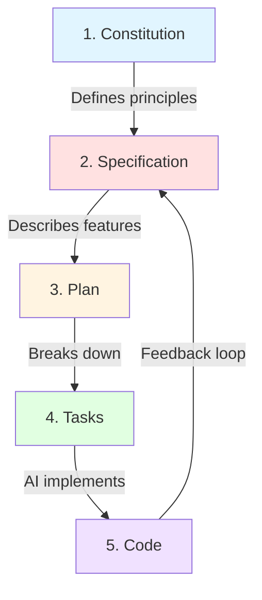

# Spec-Driven Development with AI

This repository demonstrates a revolutionary approach to software development: **Spec-Driven Development powered by AI**. Using [Speckit](https://github.com/specify-app/spec-kit) and GitHub Copilot, this project showcases how to build production-ready applications through a structured, AI-assisted workflow.

## 🎯 What is Spec-Driven Development?

Spec-Driven Development (SDD) is a methodology where you **design first, then implement**. Instead of jumping straight into code, you:

1. **Define your vision** - Create a constitution that establishes project principles
2. **Write specifications** - Document what you want to build in natural language
3. **Plan the architecture** - Break down the system into logical components
4. **Generate tasks** - Convert specs into actionable development tasks
5. **Implement with AI** - Use AI assistants to write the actual code

This approach ensures:

- ✅ Clear project direction and alignment
- ✅ Better architecture decisions upfront
- ✅ Reduced technical debt
- ✅ Faster development with AI assistance
- ✅ Living documentation that stays in sync with code

## 🏗️ The Speckit Workflow

### Overview

```
Constitution → Spec → Plan → Tasks → Implementation
     ↓           ↓      ↓       ↓          ↓
  Principles  Features Design  Work    Code + Tests
```

### Detailed Flow



## 📝 Step-by-Step Guide

### Step 1: Create the Constitution

The **constitution** is the foundational document that defines:

- Project purpose and goals
- Technical principles and constraints
- Development standards
- Decision-making criteria

**Example: `.specify/memory/constitution.md`**

```markdown
# Project Constitution

## Purpose

Build a microblogging CMS that prioritizes simplicity and user experience.

## Technical Principles

- Use modern React patterns (Server/Client Components)
- Prioritize type safety with TypeScript
- Follow Next.js 15+ best practices
- Implement security-first design with RLS

## Development Standards

- All features must have tests
- Code must pass linting before commit
- Performance budgets must be met
```

**How to create:**

```bash
# Using Speckit CLI
speckit constitution init

# Or manually create
mkdir -p .specify/memory
touch .specify/memory/constitution.md
```

### Step 2: Write the Specification

The **spec** describes WHAT you want to build in natural language. It focuses on:

- User stories and requirements
- Feature descriptions
- Acceptance criteria
- Technical constraints

**Example: `specs/001-microblog-cms/spec.md`**

```markdown
# Microblog CMS Specification

## Overview

A content management system for microblogging with Markdown support.

## Features

### Post Management

Users can create, edit, and publish posts with Markdown formatting.

- Posts start as drafts (private)
- Authors can edit drafts multiple times
- Publishing makes posts public and immutable
- Support up to 5 tags per post

### Comment System

Readers can comment on published posts.

- Comments require moderation
- Authors receive email notifications
- Moderators can approve/reject comments

## Technical Requirements

- Next.js 15+ with App Router
- Supabase for database and auth
- Row-level security for data protection
```

**How to create:**

```bash
# Using Speckit
speckit spec create 001-microblog-cms

# Or manually
mkdir -p specs/001-microblog-cms
touch specs/001-microblog-cms/spec.md
```

### Step 3: Create the Plan

The **plan** describes HOW you'll build it. It includes:

- System architecture
- Component breakdown
- Technology choices
- Database schema
- API design

**Example: `specs/001-microblog-cms/plan.md`**

```markdown
# Implementation Plan

## Architecture

### Frontend

- Next.js App Router structure
- Server Components for data fetching
- Client Components for interactivity

### Backend

- Supabase PostgreSQL database
- Next.js API routes
- Row-level security policies

## Database Schema

### Tables

1. posts (id, title, content, status, author_id, published_at)
2. tags (id, name, display_name)
3. post_tags (post_id, tag_id)
4. comments (id, post_id, author_id, content, status)
5. likes (user_id, post_id)

## API Routes

- POST /api/posts - Create post
- PUT /api/posts/[id] - Update post
- POST /api/comments - Add comment
- GET /api/posts - List posts with pagination
```

**How to create:**

```bash
# Using Speckit
speckit plan create 001-microblog-cms

# The plan can be generated from the spec using AI
speckit plan generate --from-spec specs/001-microblog-cms/spec.md
```

### Step 4: Break Down into Tasks

The **tasks** file converts the plan into actionable development work:

- Discrete, implementable chunks
- Clear acceptance criteria
- Priority ordering
- Dependencies between tasks

**Example: `specs/001-microblog-cms/tasks.md`**

```markdown
# Development Tasks

## Phase 1: Foundation

- [ ] Set up Next.js project with TypeScript
- [ ] Configure Supabase connection
- [ ] Create database schema
- [ ] Implement authentication

## Phase 2: Core Features

- [ ] Build post editor with Markdown support
- [ ] Implement draft/publish workflow
- [ ] Create tag management system
- [ ] Build post listing with pagination

## Phase 3: Engagement

- [ ] Add comment system
- [ ] Implement moderation queue
- [ ] Build like functionality
- [ ] Add email notifications

## Phase 4: Polish

- [ ] Responsive design
- [ ] Performance optimization
- [ ] Testing suite
- [ ] Documentation
```

**How to create:**

```bash
# Using Speckit
speckit tasks create 001-microblog-cms

# Generate from plan using AI
speckit tasks generate --from-plan specs/001-microblog-cms/plan.md
```

### Step 5: Implement with AI

Now comes the magic: **AI-assisted implementation**. Using GitHub Copilot or similar AI assistants:

1. **Show the AI your spec and plan**

   ```
   "I'm building a microblog CMS. Here's my spec: [paste spec]
   Let's implement the post editor component."
   ```

2. **Work task by task**

   - Take one task from your list
   - Ask AI to implement it
   - Review and refine the code
   - Test the implementation
   - Mark task as complete

3. **Iterate and improve**
   - AI generates initial implementation
   - You review and provide feedback
   - AI refines based on your input
   - Repeat until satisfied

**Example AI interaction:**

```
You: "Create a PostEditor component with Markdown preview"

AI: [Generates component code]

You: "Add tag input with max 5 tags validation"

AI: [Updates component with tag functionality]

You: "Make it work with React Server Actions"

AI: [Refactors to use server actions]
```

## 🤖 The New Way: AI-Powered Development

### Traditional Development

```
Idea → Code → Test → Debug → Refactor → Document
```

- Lots of trial and error
- Documentation often outdated
- Hard to maintain consistency
- Steep learning curve for new team members

### Spec-Driven with AI

```
Constitution → Spec → Plan → AI Implementation → Refinement
```

- Clear direction from the start
- Spec IS the documentation
- AI handles boilerplate and patterns
- Focus on architecture and business logic
- Faster iteration cycles

### Key Advantages

#### 1. **Think Before You Code**

The spec forces you to think through requirements, edge cases, and architecture before writing a single line of code. This prevents costly refactors later.

#### 2. **AI as a Junior Developer**

The AI acts like a very fast junior developer who:

- Knows syntax perfectly
- Never gets tired
- Can generate boilerplate instantly
- Follows patterns you establish
- BUT still needs your guidance and review

#### 3. **Living Documentation**

Your specs stay up to date because:

- They're the source of truth
- Changes start with spec updates
- Code is generated from specs
- Documentation and code stay in sync

#### 4. **Better Collaboration**

- Non-technical stakeholders can read specs
- Designers understand the plan
- Developers align on architecture
- Everyone knows what's being built

#### 5. **Faster Onboarding**

New team members can:

- Read the constitution to understand principles
- Review specs to learn features
- Study the plan to grasp architecture
- Jump into implementation with context

## 📁 Project Structure

This repository follows Speckit conventions:

```
blog/
├── .specify/
│   └── memory/
│       └── constitution.md      # Project principles
├── specs/
│   └── 001-microblog-cms/
│       ├── spec.md              # Feature requirements
│       ├── plan.md              # Implementation strategy
│       ├── tasks.md             # Development checklist
│       ├── data-model.md        # Database design
│       ├── contracts/
│       │   └── api-rest.md      # API contracts
│       └── checklists/
│           └── requirements.md  # Quality checks
└── microblog-cms/               # Actual implementation
    ├── app/                     # Next.js app
    ├── components/              # React components
    ├── lib/                     # Utilities
    ├── supabase/               # Database migrations
    └── tests/                  # Test suite
```

## 🛠️ Tools and Technologies

### Speckit

- **Website**: [github.com/specify-app/spec-kit](https://github.com/specify-app/spec-kit)
- **Purpose**: Spec-driven development toolkit
- **Features**:
  - Template generation
  - Spec validation
  - AI integration helpers
  - Task tracking

### AI Assistants

- **GitHub Copilot** - Code completion and generation
- **Claude/ChatGPT** - Architecture discussions and planning
- **Cursor** - AI-powered code editor

### Development Stack

- **Next.js 16** - React framework
- **TypeScript** - Type safety
- **Supabase** - Backend as a service
- **Tailwind CSS** - Styling

## 📊 Results: This Project

This microblog CMS was built using the spec-driven approach:

- **Time to MVP**: ~2 weeks (vs ~6 weeks traditional)
- **Code Quality**: High (TypeScript strict mode, ESLint passing)
- **Test Coverage**: Unit + E2E tests included
- **Documentation**: Complete and up-to-date
- **Technical Debt**: Minimal (planned architecture from start)

### What Was Built

✅ Complete post management (CRUD)
✅ Draft/publish workflow
✅ Tag system with filtering
✅ Comment moderation
✅ Like functionality
✅ Responsive 3-column layout
✅ Authentication and authorization
✅ Row-level security
✅ Email notifications
✅ Rate limiting
✅ Production-ready deployment

## 🚀 Getting Started with Spec-Driven Development

### 1. Install Speckit

```bash
npm install -g @specify/speckit
# or
pnpm add -g @specify/speckit
```

### 2. Initialize Your Project

```bash
# Create new project
mkdir my-project
cd my-project

# Initialize Speckit
speckit init

# This creates:
# - .specify/memory/constitution.md
# - specs/ directory
# - Basic templates
```

### 3. Write Your Constitution

```bash
speckit constitution edit

# Define:
# - Project purpose
# - Technical principles
# - Quality standards
# - Decision criteria
```

### 4. Create Your First Spec

```bash
speckit spec create my-feature

# Write in natural language:
# - What problem does it solve?
# - Who are the users?
# - What are the requirements?
# - What are the constraints?
```

### 5. Generate the Plan

```bash
# Use AI to help create the plan
speckit plan generate --from-spec specs/my-feature/spec.md

# Or write manually:
speckit plan create my-feature
```

### 6. Break Down Tasks

```bash
# Generate tasks from plan
speckit tasks generate --from-plan specs/my-feature/plan.md

# Or create manually:
speckit tasks create my-feature
```

### 7. Implement with AI

Use your favorite AI assistant:

```
"I have a spec for [feature]. Here it is: [paste spec]
Help me implement the first task: [paste task]"
```

### 8. Iterate and Refine

- Implement one task at a time
- Test as you go
- Update specs if requirements change
- Keep documentation in sync

## 💡 Best Practices

### 1. Start with Why

Your constitution should clearly explain WHY the project exists and WHY you made technical choices.

### 2. Be Specific in Specs

Don't write "user can create posts". Write:

- What fields are required?
- What's the max length?
- What formats are supported?
- What validations apply?

### 3. Let AI Handle Boilerplate

Use AI for:

- CRUD operations
- Form validation
- API routes
- Type definitions
- Test scaffolding

### 4. You Handle Architecture

Keep control of:

- System design decisions
- Data modeling
- Security policies
- Performance optimizations
- Business logic edge cases

### 5. Review Everything

AI-generated code should be:

- Reviewed for correctness
- Tested thoroughly
- Refactored if needed
- Understood completely (no magic)

### 6. Update Specs First

When requirements change:

1. Update the spec first
2. Update the plan if needed
3. Update tasks
4. Then update code

This keeps documentation accurate.

## 🎓 Learning Resources

### Spec-Driven Development

- [Speckit Documentation](https://github.com/specify-app/spec-kit)
- [Specification by Example](https://gojko.net/books/specification-by-example/) - Gojko Adzic
- [Domain-Driven Design](https://www.domainlanguage.com/ddd/) - Eric Evans

### AI-Assisted Development

- [GitHub Copilot Docs](https://docs.github.com/en/copilot)
- [Prompt Engineering Guide](https://www.promptingguide.ai/)
- [AI-Driven Development](https://www.oreilly.com/library/view/ai-driven-development/9781098151225/)

### Next.js + Supabase

- [Next.js Documentation](https://nextjs.org/docs)
- [Supabase Documentation](https://supabase.com/docs)
- [Row Level Security Guide](https://supabase.com/docs/guides/auth/row-level-security)

## 🤝 Contributing

Want to improve this spec-driven project?

1. Read the constitution: `.specify/memory/constitution.md`
2. Review existing specs: `specs/001-microblog-cms/`
3. Propose changes to specs first
4. Then submit code PRs

## 📄 License

MIT License - See LICENSE file for details

## 🙏 Acknowledgments

- [Speckit](https://github.com/specify-app/spec-kit) - For the spec-driven methodology
- [GitHub Copilot](https://github.com/features/copilot) - For AI-powered coding
- [Next.js](https://nextjs.org/) - For the excellent framework
- [Supabase](https://supabase.com/) - For the backend infrastructure

---

**Built with 🧠 using Spec-Driven Development and AI**

_The future of development is here: Think deeply, specify clearly, let AI build._
